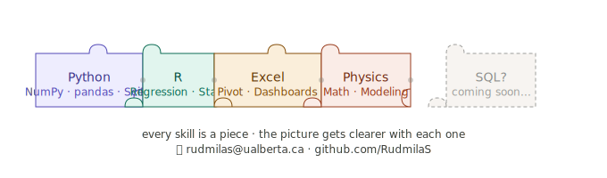

# Hi, I'm Rudmila 👋

**Mathematical Physics undergraduate @ University of Alberta | Science Co-op Program**  
📍 Edmonton, AB &nbsp;|&nbsp; 📧 rudmilas@ualberta.ca

---

## About Me

I'm a 3rd-year Mathematical Physics student with a strong focus on **data analysis, numerical modeling, and statistical computing**. I work primarily in Python and R, applying quantitative methods to real observational and experimental datasets.

I'm currently seeking a **4–16 month data analytics or solutions delivery internship** beginning May 2026 through UAlberta's Science Co-op Program.

---

## 🛠️ Tools & Skills

| Area | Tools |
|------|-------|
| **Languages** | Python · R · Excel |
| **Python Libraries** | NumPy · pandas · Matplotlib · SciPy · Jupyter |
| **Data Skills** | Statistical Analysis · Regression · Data Visualization · Uncertainty Quantification |
| **Methods** | Numerical Modeling · Curve Fitting · Interpolation · Root-Finding |

---

## 📁 Featured Projects

### 🔭 [Solar Differential Rotation Analysis](https://github.com/RudmilaS/Solar-Differential-Rotation)
Analyzed NASA SDO observational data using Python to identify differential rotation trends across solar latitude bands. Built a heliocentric coordinate framework, applied trigonometric modeling, and developed data visualizations to support model interpretation.  
`Python` `NumPy` `pandas` `Matplotlib` `Observational Data`

---

### ⚙️ [Classical Mechanics Numerical Modeling](https://github.com/RudmilaS/classical-mechanics-modeling)
Derived equations of motion from first principles and validated theoretical predictions using Python-based numerical simulations. Also evaluated generative AI outputs for computational accuracy and documented systematic error modes.  
`Python` `NumPy` `Matplotlib` `Numerical Methods`

---

### 🔬 [Computational Physics Lab Analysis](https://github.com/RudmilaS/computational-physics-labs)
End-to-end data analysis across 4 physics lab courses (PHYS 144, 234, 295, 362). Applied weighted linear regression, uncertainty propagation, and advanced interpolation methods to real experimental datasets including Hooke's Law, Malus' Law, and Faraday effect verification.  
`Python` `SciPy` `pandas` `Matplotlib` `Statistical Analysis`

---

### 📊 [Personal Financial Analytics Dashboard](https://github.com/RudmilaS/financial-analytics-dashboard)
Built a multi-sheet Excel dashboard tracking income, expenses, and savings across 10+ categories with automated formulas, pivot tables, and month-over-month trend visualizations.  
`Excel` `Data Analysis` `Pivot Tables` `Visualization`

---

## 📚 Currently Studying
- Mathematical Methods · Statistical Mechanics · Quantum Mechanics
- Exploring: SQL for data analysis · Kaggle datasets
